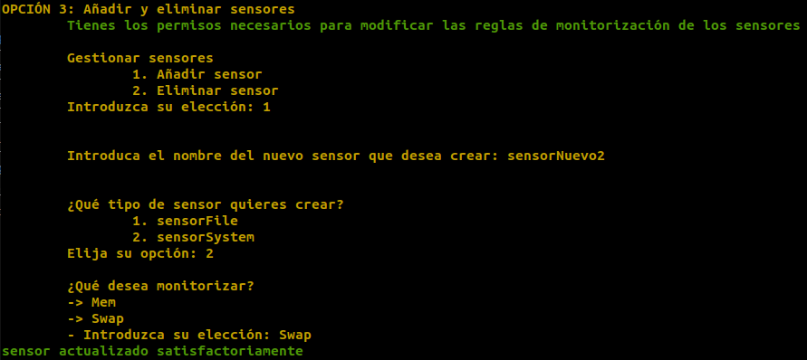
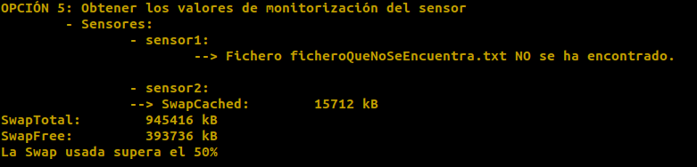

# DMS course project codebase, academic year 2020-2021

The goal of this project is to implement a systems monitoring appliance deployed across several interconnected services.

## Components

The source code of the components is available under the `components` direcotry.

### Services

The services comprising the appliance are:

#### `dms2021auth`

This is the authentication service. It provides the user credentials, sessions and rights functionalities of the application.

See the `README.md` file for further details on the service.

#### `dms2021sensor`

This service takes several measurements on the system, letting the clients know about the status of the system during a period of time.

See the `README.md` file for further details on the service.

### Applications

The applications of the appliance.

#### `dms2021client`

A client application, serving as a console to configure and monitor the different services.

See the `README.md` file for further details on the application.

### Libraries

These are auxiliar components shared by several services.

#### `dms2021core`

The shared core functionalities.

See the `README.md` file for further details on the component.

## Docker

The application comes with a pre-configured Docker setup to help with the development and testing (though it can be used as a base for more complex deployments).

To run the application using Docker Compose:

```bash
docker-compose -f docker/config/dev.yml up -d
```

When run for the first time, the required Docker images will be built. Should images be rebuilt, do it with:

```bash
docker-compose -f docker/config/dev.yml build
```

To stop and remove the containers:

```bash
docker-compose -f docker/config/dev.yml rm -sfv
```

By default data will not be persisted across executions. The configuration file `docker/config/dev.yml` can be edited to mount persistent volumes and use them for the persistent data.

The client service/application is run detached when run using the above Docker Compose call, but ready to accept input through a TTY. To attach the current shell to the container (this will redirect the current shell STDIN, STDOUT and STDERR to/from the container):

```bash
docker container attach dms2021client
```

(use the sequence Ctrl+P,Ctrl+Q to detach again without interrupting the process)

To see the output of a container:

```bash
docker logs CONTAINER_NAME
# To keep printing the output as its streamed until interrupted with Ctrl+C:
# docker logs CONTAINER_NAME -f
```

To enter a running service as another subprocess to operate inside through a terminal:

```bash
docker exec -it CONTAINER_NAME /bin/bash
```

To see the status of the different containers:

```bash
docker container ps -a
```

For testing convenience, container path `/tmp/sensor-volume` in `dms2021sensor1` and `dms2021sensor2` are mapped to host directories `/tmp/sensor1-volume` and `/tmp/sensor2-volume` respectively. These can be used to test the sensor detection functionalities on a given file system without opening shells inside each sensor manually.

## Helper scripts

The directory `scripts` contain several helper scripts.

- `verify-style.sh`: Runs linting (using pylint) on the components' code. This is used to verify a basic code quality. On GitHub, this CI pass will fail if the overall score falls below 7.00.
- `verify-type-correctness.sh`: Runs mypy to assess the type correctness in the components' code. It is used by GitHub to verify that no typing rules are broken in a commit.
- `verify-commit.sh`: Runs some validations before committing a changeset. Right now enforces type correctness (using `verify-type-correctness.sh`). Can be used as a Git hook to avoid committing a breaking change:
  Append at the end of `.git/hooks/pre-commit`:

  ```bash
  scripts/verify-commit.sh
  ```
# Uso de la aplicación

Trás haber seguido las instrucciones de instalación descritas en los puntos anteriores, nos encontramos con la primera "página", la de Login.

## Login

Opción en la cual se debe introducir el nombre del usuario así como su correspondiente contraseña para poder acceder a la aplicación.
    - Usuarios disponibles:
        - Username: *admin* (tiene todos los posibles permisos)
          - Password: *admin*
        - Username: *cliente*
          - Password: *cliente*
  
  

- **Menú principal**: página que sigue al **Login** donde se nos muestra todas las posibles opciones que cuenta la aplicación, tal y como se demuestra en la siguiente ilustración.

  

  En este **Menú principal** tenemos las siguientes opciones:

  **1. Crear usuarios**: creación de nuevos usuarios, siempre y cuando se tengan los permisos necesios para ello.
    - Si se disponen de los permisos necesarios aparecera una nueva "página" con un formulario a completar.
      - El username y el password del nuevo usuario.
  
      
      - Si la operación se ha relizado correctamente, aparece:
        
      - En caso contrario (el usuario que se intenta crear ya existe), aparece:
        

  **2. Modificar Permisos**: esta opción tiene la funcionalidad de modificar los permisos de usuario existementes en la aplicación, siempre y cuando se tengan los permisos necesarios para ello.
    - Si se disponen de dichos permisos aparecerá una nueva "página" con un formulario a completar.
      - Donde se introducen:
        - El username del usuario al cuál se quieren modificar sus permisos.
          
        - Introducir la acción a realizar 1 ó 2, para añadir o revocar permisos respectivamente.
      
          
          - Y por último, el permiso que se desea añadir o revocar.
            
            
            - Si el usuario especificado ya tiene un permiso asignado, no se le puede volver a asignar.
            
            - Si el usuario especificado no tiene un permiso, este no se le puede revocar.
            

  **3. Acceder a gestionar sensores**: opción que te permite agregar o eliminar sensores, siempre y cuando se tengan los permisos necesarios.
    - Indicar la acción a realizar 1 ó 2 (añadir ó eliminar sensor).
      - Introducir el nombre del sensor a añadir.
        - Elegir el tipo de sensor a añadir.
          - SensorFile (1):
            - Introducir el nombre del fichero a encontrar.
              
          - SensorSystem (2).
            - Elegir entre Men ó Swap:
              
      - Introducir el nombre del sensor a eliminar.
        

  **4. Modificar las reglas de monitorización de cada sensor**: opción que permite cambiar las reglas de monitorización de cada uno de los sensores, sí y sólo si se tienen los correspondientes permisos.
    - Seleccionar el sensor al cual se quieren cambiar los ajustes.
      - Seleccionar el nuevo tipo de sensor que se desea.
        - SensorFile (1):
          - Introducir el NOMBRE del fichero que se desea buscar.

            
        - SensorSystem (2):
          - Introducir qué es lo que se desea monitorizar (Men (defecto) ó Swap):
          

  **5. Obtener los valores de monitorización de cada sensor**: opción que permite obtener los diferentes valores que tienen los sensores de la aplicación, sólo si se tienen los permisos necesarios.
    - **Valores de monitorización por defecto**:
      - Búsqueda del fichero "ficheroABuscar.txt".
      - Monitorización de la memoria RAM del sistema.
      
      Ejemplo: 
      
    - **Si se han modificado anteriormente las reglas de los sensores, apareceran la monitorización correspondiente a esas reglas definidas**. 
    
      Ejemplo:
      

  **6. Salir**: opción que permite el Logout de la aplicación.

    


 


