# DMS 2020-2021 Sensor Service

This service provides sensing functionalities to the appliance.

## Installation

Run `./install.sh` for an automated installation.

To manually install the service:

```bash
# Install the service itself.
./setup.py install
```

## Configuration

Configuration will be loaded from the default user configuration directory, subpath `dms2021sensor/config.yml`. This path is thus usually `${HOME}/.config/dms2021sensor/config.yml` in most Linux distros.

The configuration file is a YAML dictionary with the following configurable parameters:

- `db_connection_string` (mandatory): The string used by the ORM to connect to the database.
- `host` (mandatory): The service host.
- `port` (mandatory): The service port.
- `debug`: If set to true, the service will run in debug mode.
- `salt`: A configurable string used to further randomize the password hashing. If changed, existing user passwords will be lost.
- `auth_service`: A dictionary with the configuration needed to connect to the authentication service.
  - `host` and `port`: Host and port used to connect to the service.

## Running the service

As only sensor1 is implemented, it can only be executed throught the command `dms2021sensor1` as any other program.

## REST API specification for sensor

This service exposes a REST API so other services/applications can interact with it.

- `/` [`GET`]

  Status verification.
  - Returns:
    - `200 OK` if the service is running.
  - Example for sensor1
     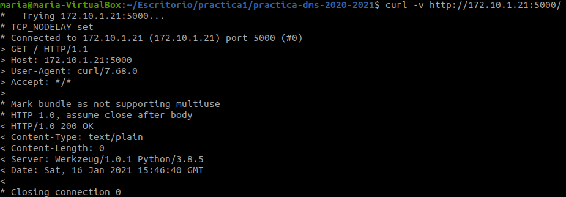
  - Example for sensor2
  - 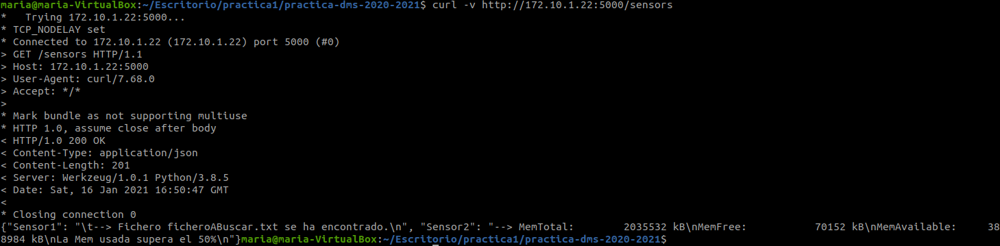
    
- `/sensors/<str: sensorname>/value` [`GET`]
  Gets the value monitorized by the specified sensor
  - Parameters: 
    - `sensorname` [path] (`str`): The sensor name
  - Returns:
    - `200 sensorvalue` if the value of the sensor was sent succesfuly
    - `404 Not foud` if the sensor doesn't existe
  - Example for sensor1
    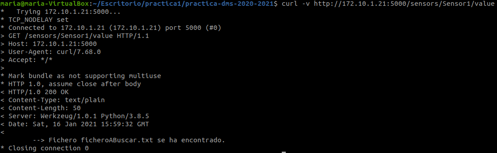    
  - Example for sensor2
    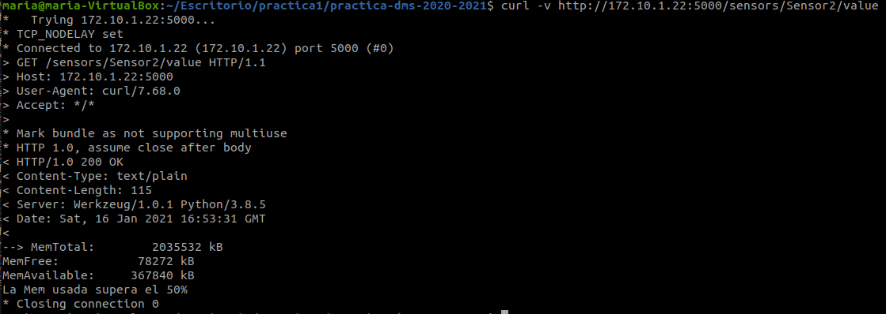

- `/sensors/<str: sensorname>` [`POST`]: 
  Put a new file to search by a specific sensor, if it's sensor1, or put the memory type (Mem or Swap) for sensor2
  - Parameters: 
    - `sensorname` [path] (`str`): The sensor name
    - `sensor_type` [from data] (`str`): new type of the sensor
    - `parameters` [from data] (`str`): aditional parameters for the new sensor type
      - For sensor1, the name of the file to search.
      - For sensor2, Mem or Swap.
  - Returns:
    - `200 OK` if the sensor was succesfully updated
    - `404 Not found` if the recieved parameters are invalid
  - Example for sensor1
    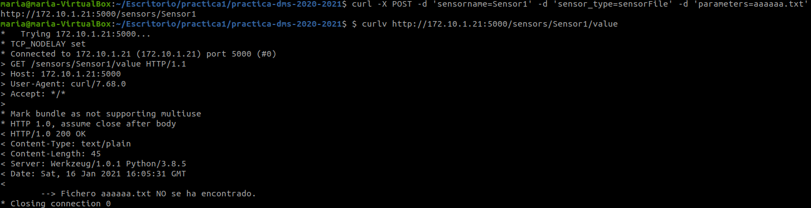
  - Example for sensor2
    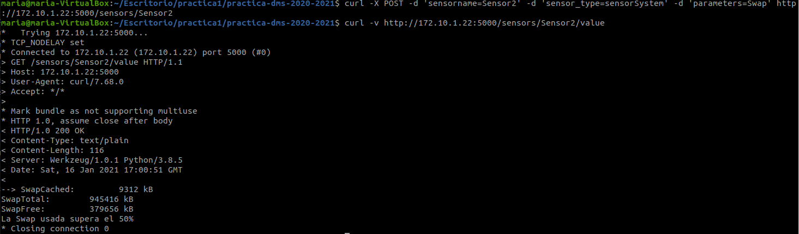

    
- `/sensors/<str: sensorname>/new` [`POST`]
  Add a new sensor
  - Parameters: 
    - `sensorname` [path] (`str`): The new sensor name
    - `sensor_type` [from data] (`str`): type of the sensor (sensorFile or sensorSystem)
    - `parameters` [from data] (`str''): aditional parameters for the new sensor (file to search).
  - Example for sensor1
    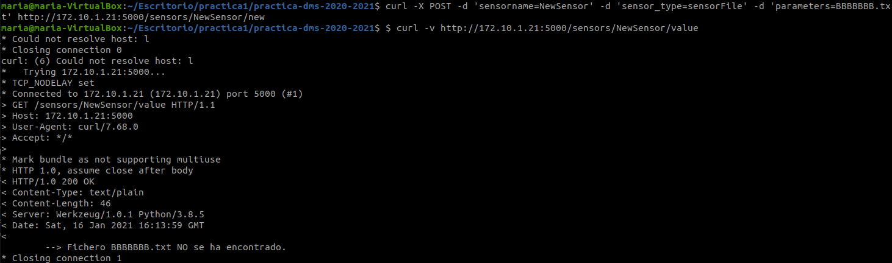
  - Example for sensor2
    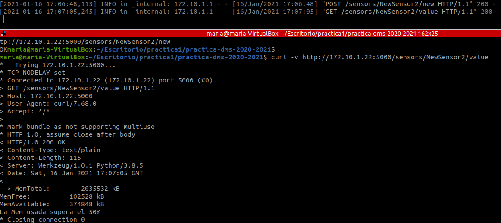
    
- `/sensors/<str: sensorname>` [`DELETE`]
  Remove the sensor with a specific name, if it exists.
  - Parameters:
    - `sensorname` [path] (`str`): The sensor name
  - Returns:
    - `200 OK` if the sensor was succesfully removed
  - Example for sensor1
    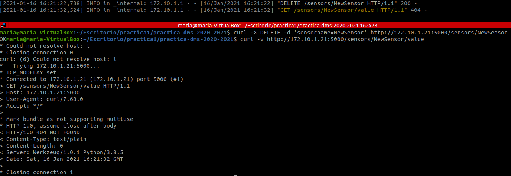
  - Example for sensor2
    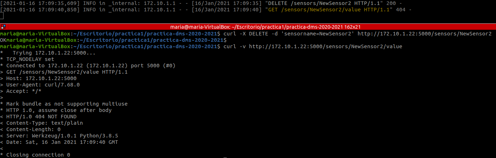
  - **Note: obviously when we want to check the value of a sensor that doesn't exist we get 404 error.**

- `/sensors` [`GET`]: 
  Gets all the names-values of the monitorized sensors
  - Returns:
    - `200 sensorsname` if the name of every sensor was sent succesfuly
    - `404 No sensors` if the service has no sensors
  - Example for sensor1
    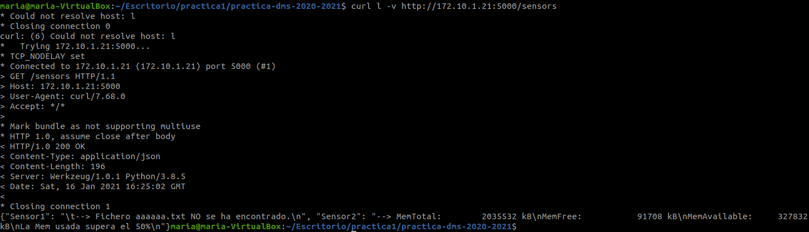
  - Example dor sensor2
    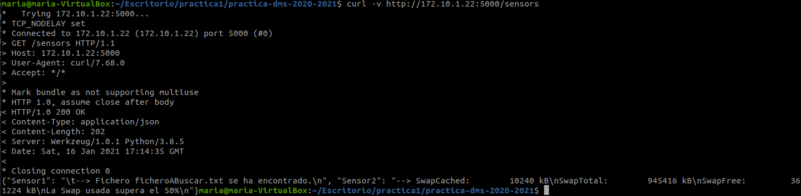

- `/sensors/types` [`GET`]: 
  Gets all the posible types of monitorized sensors
  - Returns:
    - `200 sensortypes` if the possible types of sensors was sent succesfuly
  - Example for sensor1
    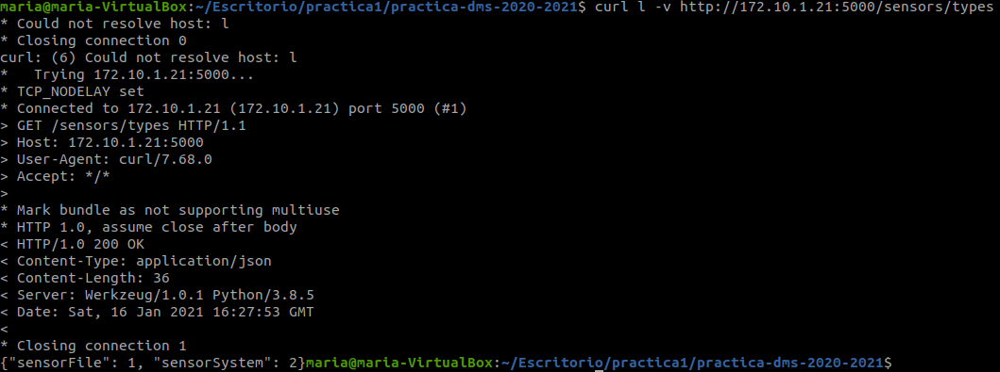
  - Example for sensor2
    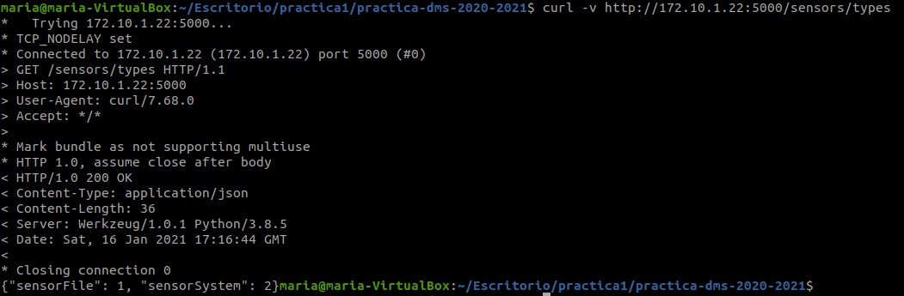

- `/sensors/values` [`GET`]
  Gets all the values monitorized by all sensors
  - Returns:
    - `200 values of sensors` if the values of every sensor was sent succesfuly
    - `404 Not found`if the sensor service has no sensors
  - Example for sensor1
    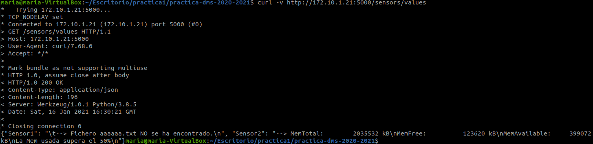
  - Example for sensor2
    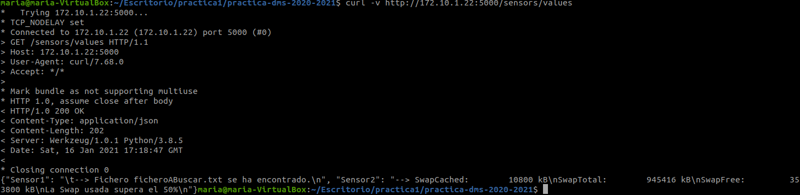

# Arquitectura

## Diagrama UML (Primera entrega)
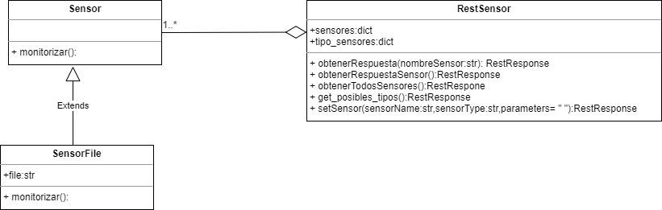

## Diagrama UML (Segunda entrega)
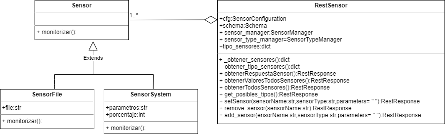

## Esquema de la Base de Datos
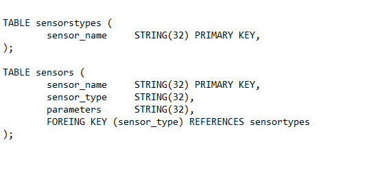

## Descripción de la arquitectua

dms2021sensor esta dividido en dos carpetas `data` y `logic`. 
 - En la carpeta `data` podemos encontrar:
   - Dentro de la carpeta `config`, un fichero `sensorconfiguration.py` mediante el cual se obtienen los datos necesarios para establecer el servicio.
   - También nos encotramos con el fichero `Sensor.py` donde está definido una clase abstracta denominada 'Sensor' y un método abstracto 'monitorizar'. Esta clase es utilizada para definir los diferentes sensores que componen esta práctica.
   - Finalmente nos encontramos con `SensorFile.py` y `SensorSystem.py`, los cuales tienen las clases concretas que heredan de Sensor e implementan el metodo monitorizar.
 - En la carpeta `logic` podemos encontrar:
   - Una carpeta denomida 'exc':
     - Donde encontramos `sensorerror.py` donde esta definido `SensorError` que lanza excepciones.
   - Una carpeta `rest`:
     - Que contine el fichero `restSensor.py` que contiene la clase `RestSensor` mediante la cual se establece la conexion del servicio.
     
## Tipos de sensores
   - `SensorFile.py` en el cuál esta definida la clase 'SensorFile', implementa la clase abtracta anteriormente mencionada 'Sensor' así como el correspondiente método 'monitorizar'. Mediante esta clase se determina la existencia o no, de un determinado fichero en el sistema.
     - El fichero de texto 'ficheroABuscar.txt' es usado como fichero por defecto para realizar la búsqueda. Este fichero se encuenta en la misma carpeta `data` que `sensorFile.py`.
   - `SensoRSystem.py` en el cuál esta definida la clase 'SensorFile', implementa la clase abtracta anteriormente mencionada 'Sensor' así como el correspondiente método 'monitorizar'. Mediante esta clase se comprueban dos posibles tipos de memoria, la memoria `RAM` del sistema o la memoria `Swap`. Adicionalmente, el mètodo 'monitorizar' compruba si la memoria ocupada excede un porcentaje o no.
     - Por defecto, se monitoriza la memoria RAM y se comprueba si se excede el porcentaje del 50% de memoria.
     
## Actualizaciones en la segunda entrega
- Se ha añadido al protocolo de comunicaciones las direcciones y los métodos necesarios para recibir y enviar ordenes y respuestas de añadido y eliminación de sensores.
- Se ha actualizado la clase `RestSensor` para poder añadir y eliminar sensores de acuerdo a la actualizaciónd el protocolo de comunicación.

### Base de datos de los sensores
Hay dos tablas utilizadas para mantener la persistencia de los sensores:
- `TipoSensores`: Esta tabla tiene solo un campo, que es el nombre del tipo de sensor.
- `Sensores`: Esta tabla tiene toda la información relevante sobre los sensores. Cada sensor es una tupla y tiene 3 campos: el nombre del sensor, el tipo del sensor y los parametros del sensor.
Viendo la tabla `Sensores` se podría poner en duda la existencia de la tabla `TipoSensores`, pero con esta tabla se hace que el campo del tipo de sensor de la tabla `Sensores` sea una clave foranea de `TipoSenores`, evitando de esta forma que se pueda introducir un tipo de sensor que no exista.
